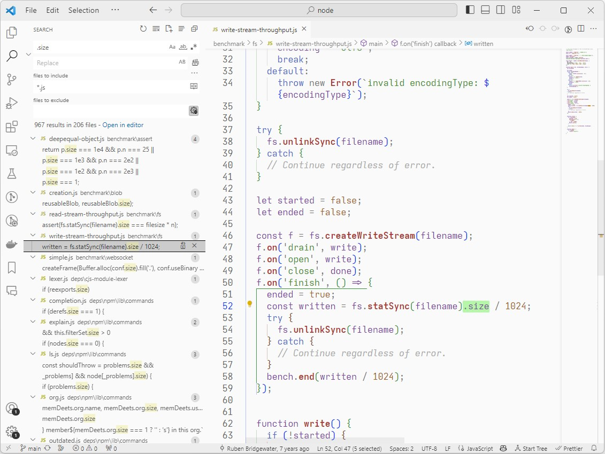

# Saturday Light

Saturday Light is a low contrast light theme for VS Code. I use it at work, where our office lights are strong and I sit by a window. Ian Beck's Quiet Light was pretty much what I wanted, this builds on that. The theme is named after the Boards of Canada song "Hey Saturday Sun".

Search for "Saturday Light" on the extension marketplace. Under the author "Supermarket Cartographer" (I've yet to update this)

I have strange opinions on how things should look, because I have specific issues with my vision that push me towards low-contrast themes. This is pretty irregular as far as visual impairment goes! I'd highly encourage you to roll your own light theme if you want something tweaked.
